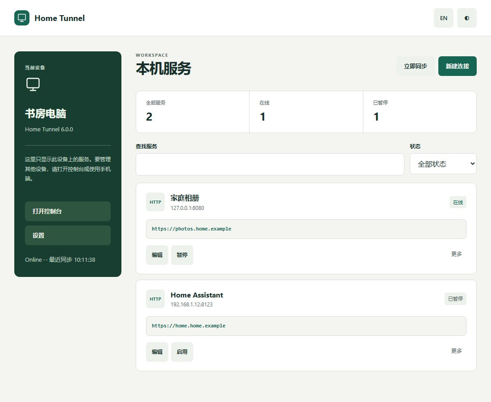

  
  <h1>Home Tunnel Client</h1>
  
<strong>Desktop and command-line clients focused on this computer</strong>

  
 

  
<a href="README.md">简体中文</a> · <a href="https://zhanry.github.io/home-tunnel/">Website</a>

The Windows 6.0.0 EXE was withdrawn after a Defender detection. Version 6.0.1 uses a standard installer with antivirus and installation checks; see [Windows release checks](docs/WINDOWS_RELEASE_CHECKS.md).

The 6.0 desktop app is rebuilt around local services, with separate device status, search, status filters, connection editing and settings. GUI and CLI share the same client core.

## Download

Choose a package from [Releases](https://github.com/ZHanry/home-tunnel-client/releases/latest):

| Platform | Package |
| --- | --- |
| Windows x64 | `HomeTunnel-Setup-6.0.1-x64.exe`, or the portable `.zip` |
| Linux amd64 / arm64 | `home-tunnel-linux-6.0.1-<arch>.tar.gz` |
| macOS Intel / Apple Silicon | `home-tunnel-macos-6.0.1-amd64.tar.gz` / `arm64.tar.gz` |

Packages include the client and managed Agent. Use the installer or included installation script, then enter your console URL and account. `SHA256SUMS.txt` contains package checksums.

## Use

1. Add a service in Local services, choosing a name and public address.
2. Enter the host and port reachable from this computer. Use `127.0.0.1` for a service running here.
3. Copy the public address after the connection becomes online. Search, pause, enable and edit from the service list.
4. Use the Web console or Android app to manage other computers.

Each registered computer only shows its own connections, even when several computers share an account. Closing the window keeps the runtime active; quitting stops local tunnels; signing out also clears device credentials.

## CLI and development

Headless computers and NAS devices use the CLI and service configuration in the package. See [operations](docs/OPERATIONS.md). Entrypoints live in `cmd/`, shared code in `internal/`, and the independent FRP module in `agent/`. Build with Go 1.26.6; run `go test ./...` and `pnpm test:browser`.

[Releasing](docs/RELEASING.md) · [Release notes](docs/RELEASE_NOTES.md) · [Security](SECURITY.md) · [Project hub](https://github.com/ZHanry/home-tunnel)

