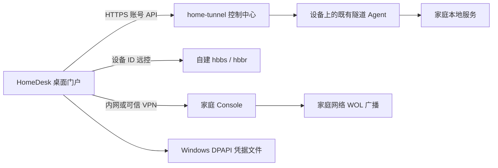

# HomeDesk 与 home-tunnel 完整门户方案

日期：2026-10-01。用户要求 HomeDesk 作为统一门户，并授权按目标模式自主完成设计、实施和本地交付，中间无需确认。本文细化 [DESIGN.md 5.4](DESIGN.md#54-homedesk-统一门户2026-10-01)，不会替代唯一设计契约。

## 产品范围

用户从 HomeDesk 桌面首页进入家庭设备、远控最近连接和家庭服务。家庭服务直接使用自建 home-tunnel 的账号资源，统一查看、访问和日常编辑；RustDesk 仍负责桌面数据通道和被控端认证。

| 功能 | 本轮交付 |
| --- | --- |
| 登录 | 自定义 HTTPS origin、真实平台账号会话、MFA 手动提交、错误提示、单次刷新、退出。 |
| 记住登录 | Windows DPAPI 当前用户加密，勾选后在下次进入服务页恢复；其他平台准确禁用持久化，不写明文。 |
| 设备 | 全部分页、状态和服务分组、筛选、版本保护的标签与收藏管理；设备名按现有 API 只读。 |
| 服务 | HTTP/HTTPS、TCP/UDP 创建、名称/本地目标编辑、暂停/恢复、确认删除，遵守账号协议能力和版本保护。 |
| 访问 | 网页交给浏览器，原始协议复制真实端点，任何 URL/剪贴板均不携带门户 Token。 |
| 高级管理 | 原管理台入口用于账号安全、域名/访问策略和运营者设置；不伪造当前账号 API 不支持的操作。 |

## 组件与数据路径

门户不直接修改服务端 SQLite，也不运行 FRP Agent。远控服务与隧道服务可以共享公网宿主机，但保持固定版本、独立数据卷和原生端口；当前已有 `server/compose.public.yml` 与部署校验用于 RustDesk，不增加协议转换器。

## 登录与持久化状态

首次主页不联网。“家庭服务”首次初始化只检查本机配置与可用的安全存储；未启用已确认公网模式时不消费保存凭据、不请求公网。Windows 用户首次登录仍手动输入账号及 MFA，默认不记住。

记住记录只包含版本、origin、账号 ID/显示信息、刷新 Token 和有效期。整个 JSON 通过 DPAPI CurrentUser 加密，独立存于应用支持目录下的门户子目录；使用禁止交互提示的系统 API。密码、MFA 和访问 Token 不落盘，Crypto 失败无明文回退。

恢复/轮换过程为：原子消费旧密文记录，向该固定 HTTPS origin 刷新一次，校验新 Token 和 `/auth/me` 身份，原子保存新密文，最后将会话交给 UI。中间任何失败、进程退出或未知响应都不能重新读取旧 Token 续期。并发目录请求共用一个刷新任务；存储事务代次阻止退出/清除后迟到保存。

正常关闭应用保留已完成保存的记录；显式退出、模式/许可变化、身份不符及刷新失败条件失效本实例拥有的记录和在途事务，旧实例不得误删另一实例在新许可下明确登录的记录。明确“忘记登录”才全局清除。没有恢复 API 的纯内网页面不读取、消费或异步清除其他实例记录，也不联网；恢复仍需匹配本机批准地址和新的有效许可，并复验账号身份，不从保存的登录状态推导公网权限。

## 资源操作与兼容性

使用 home-tunnel Server 10.1.0 / `api-v1.5.0` 的真实账号资源路由。登录不登记设备，因此设备和连接目录为该账号所属范围，管理员也不从此入口访问其他用户。

- HTTP/HTTPS 的区别是本地协议配置，均是 HTTP 类型的隧道。子域与本地 host/port 必须校验，最终访问地址只使用服务端返回值。
- TCP/UDP 只有服务端能力允许时出现；管理员管理端口池，账号创建服务由服务端分配端口。UI 不伪造管理员权限，也不把 raw 端点拼成网页。
- 编辑提交当前 `expected_version`，设备标签/收藏提交 `expected_metadata_version`；端口和传输类型不可通过 PATCH 变更。409 保留草稿，读取最新版本后在应用中核对并再次提交。
- 创建、编辑、启停和删除有实体互斥。401 可单次刷新后重试确定被认证拒绝的请求；网络失响应不自动重复写操作，提示结果未知并提供刷新核对。
- 所有写资源使用验证后的 UUID。标签数量/长度、名称、host/port 等按实际契约校验，原有未编辑的访问策略不被覆盖。

## 工程边界

主要代码放独立 `homedesk_tunnel_api`、`homedesk_tunnel_session`、`homedesk_credentials`、`homedesk_services` 和编辑器模块。上游首页只做 builder 接线，Rust 动态许可继续走已有 local-option 通道，修改均标记 `HOMEDESK`。不升级 Cargo/Flutter 依赖，不修改 RustDesk 传输、编解码或密码/加密核心。

## 实施顺序与验收

1. 固定真实 API 契约，完成资源 DTO、合法路由、版本冲突及恢复/轮换接口。
2. 实现并用临时目录验证 Windows DPAPI、密文损坏拒绝、原子消费、并发与迟写失效；测试不碰现用凭据目录。
3. 在现有门户加登录恢复、设备元数据和服务编辑器，完成实体 busy、删除确认、冲突与未知结果交互。
4. 独立审阅网络/凭据/操作状态机，跑针对性 API 与组件回归，检查深浅色、窄窗口和大字体。
5. 用合成配置完成 Windows Rust/Flutter Release 与独立测试包，保持旧包和现用安装不变，记录源码范围、摘要和 smoke。

开发完成的门禁是设计范围内的代码、针对性自动验证、独立审阅、目标平台构建和可审阅测试包。真实 home-tunnel HTTPS/MFA/撤权、NAS服务访问、RustDesk 独立跨网会话和 Linux/ARM64 真机验收需要相应环境，缺少环境时准确保留未执行项；不因缺少真实地址/密钥中断可完成的开发，也不宣称已部署或已实机通过。
